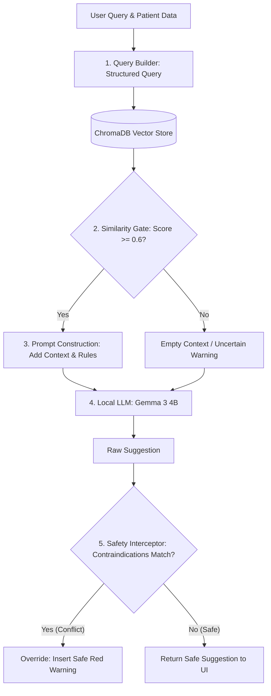

# PhysioWave

PhysioWave is a HIPAA-compliant, local-first clinical assistant platform designed for healthcare professionals. It leverages locally hosted AI models to provide secure, real-time clinical decision support and workflow automation without exposing sensitive patient data to external APIs.

## Architecture

*   **Frontend**: Modern Web Application built with Next.js 15 and Tailwind CSS.
*   **Backend**: Python FastAPI handling API requests, safety gating, and orchestrating models.
*   **AI Local Engine**: Ollama running **Gemma 3** (local inference), **Llava/Moondream** (multimodal vision), and **ChromaDB** for Retrieval-Augmented Generation (RAG).
*   **PDF Processing**: Open-source, local PDF extraction and indexing for internal medical guides.

### Safety Gate Architecture Flowchart



For detailed architecture diagrams, database schemas, and future roadmap specifications, see the references below:
*   📚 **[Technical Architecture & Development Spec](architecture/technical_architecture_and_roadmap.md)**: Deep dive into the RAG design, safety gates, database tables, and engineering enhancement plans.
*   🎯 **[Technical Interview Study Guide](architecture/interview_prep_cheatsheet.md)**: Curated Q&As, implementation explanations, and presentation scripts for interviews.


## Prerequisites

*   Python 3.14+
*   Node.js 25+
*   Ollama (must be installed and running on your system)
*   Docker & Docker Compose (optional, for containerized deployment)

## Setup Instructions

### 1. Local Setup (Recommended for Development)

1.  **Run the Setup Script**
    Open PowerShell in the root directory and run:
    ```powershell
    .\setup.ps1
    ```
    *This script automatically verifies prerequisites, pulls the correct models via Ollama, installs backend & frontend dependencies, and prepares the PDF assets directory. It also repairs broken virtual environments if you upgrade Python.*

2.  **Add Your PDF Assets**
    Copy any equipment manuals or clinical reference materials to `backend/assets/`.

3.  **Configure Environment**
    If the setup script didn't generate one, create a `.env` file in the `backend` directory based on `.env.example`. 
    
    Key variables include:
    *   `ENCRYPTION_KEY`: A unique key to protect PII at rest (generate via Fernet).
    *   `LLM_MODEL`: Default is `gemma3:4b`.
    *   `VISION_MODEL`: Default is `moondream` (used for multimodal PDF indexing).
    *   `EMBEDDING_MODEL`: Default is `nomic-embed-text`.
    *   `OLLAMA_BASE_URL`: Default is `http://localhost:11434`.

### 2. Docker Setup (Recommended for Production/Testing)

Alternatively, you can run the entire stack using Docker:

```bash
docker compose up -d --build
```

*Note: Ensure Ollama is running on the host or configured correctly within the compose environment.*

## Running the Application (Local)

To start the PhysioWave environment locally, run the following in three separate terminal windows:

**Terminal 1 (Ollama Service):**
```powershell
ollama serve
```

**Terminal 2 (Backend):**
```powershell
# Set PYTHONPATH to the root directory
$env:PYTHONPATH = "."
.\backend\.venv\Scripts\activate
uvicorn backend.main:app --reload
```

**Terminal 3 (Frontend):**
```powershell
cd frontend
npm run dev
```

Finally, open your browser and navigate to: **[http://localhost:3000](http://localhost:3000)**

## License
Proprietary / Closed Source
