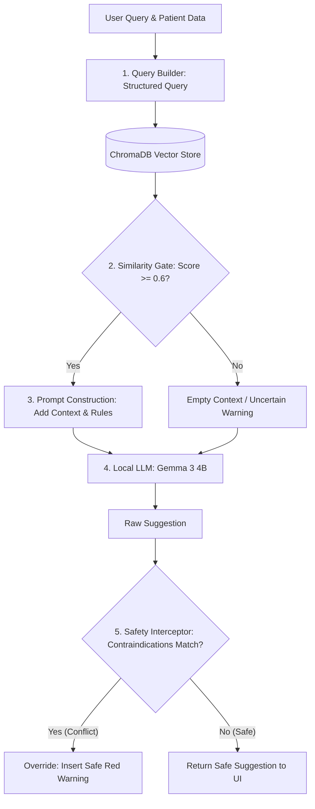

# PhysioWave — Technical Interview Study Guide

This cheat-sheet compiles the technical Q&A from our architectural sessions, structured specifically for quick review and verbal presentation prep before an interview.

---

## 🔍 Q1: In our RAG, what type of search did we use?

### **Core Answer**
We use **Dense Semantic Search** (Vector Search). The system encodes natural language queries into 768-dimensional dense vectors using a local embedding model (`nomic-embed-text` run via Ollama) and searches a locally-hosted, persistent instance of **ChromaDB**. 

The search utilizes **HNSW (Hierarchical Navigable Small World)** indexing with **Cosine Similarity** as the distance metric.

### **Key Specifications**
* **Vector DB:** ChromaDB (Local SQLite-backed persistent client).
* **Index Type:** HNSW (Hierarchical Navigable Small World graph).
* **Metric:** Cosine Similarity (ChromaDB computes Cosine Distance; we filter based on similarity: `score = 1.0 - distance`).
* **Embeddings:** `nomic-embed-text` (768 dimensions).
* **Filtering:** Score threshold gating (similarity $\ge 0.6$).

### **Why We Chose This Approach**
1. **On-Device HIPAA Compliance:** We run ChromaDB and Ollama locally. Clinical guides and search queries remain on-premise, preventing patient data leakage to external SaaS vectors (like OpenAI or Pinecone).
2. **Context-Aware Semantic Search:** Traditional keyword matching (BM25) fails when terms differ. Clinicians can search for "low back pain" and retrieve documents explaining "lumbar radiculopathy" because both map to nearby points in the vector space.
3. **Graph-based Scaling (HNSW):** HNSW provides logarithmic search time complexity, maintaining sub-millisecond retrieval speeds as the collection grows.

### **How to Present This in an Interview**
> *"In our RAG pipeline, we use **Dense Semantic Search**. We generate 768-dimensional dense vector embeddings using a locally run embedding model, `nomic-embed-text` via Ollama. We store and query these vectors in an on-device instance of **ChromaDB** configured to use **Hierarchical Navigable Small World (HNSW)** indexing with **Cosine Similarity** as the distance metric. This local deployment guarantees zero-data leakage for HIPAA compliance, and semantic search ensures we retrieve context by conceptual meaning rather than exact keyword matching."*

---

## 🔍 Q2: What embedding model do we use, and why?

### **Core Answer**
We use **`nomic-embed-text`** hosted locally via **Ollama**, which generates **768-dimensional dense vector embeddings** for both text chunks and queries.

### **Model Specifications**
* **Developer:** Nomic AI
* **Context Window:** 8192 tokens (extremely large context window).
* **Dimension:** 768 dimensions (optimal balance between execution speed and semantic expression).
* **Open Source License:** Apache-2.0.

### **Why We Chose It**
1. **Offline HIPAA Compliance:** Runs fully locally via Ollama without requiring external API calls.
2. **Superior Context Capacity:** Standard models (like `all-MiniLM-L6-v2`) truncate text at 256/512 tokens. `nomic-embed-text` handles 8192 tokens, ensuring long manual pages are fully processed without information loss.
3. **Resource Efficiency:** Lightweight enough to run comfortably alongside our main LLM (`gemma3:4b`) on consumer or mid-range hospital servers without causing GPU VRAM OOM crashes.
4. **MTEB Benchmark Performance:** Outperforms proprietary models (like OpenAI's text-embedding-ada-002) in retrieval-centric search tests.

### **How to Present This in an Interview**
> *"We use Nomic AI's **`nomic-embed-text`** model hosted locally via Ollama. It outputs 768-dimensional dense vectors. We chose it because it supports an **8,192-token context window**—allowing us to parse long clinical reference paragraphs without truncation—while operating within a small memory footprint, allowing it to easily co-exist on the same local GPU as our primary LLM."*

---

## 🔍 Q3: What evaluation metrics and evaluation techniques were used?

### **Core Answer**
Due to strict HIPAA and offline constraints, we did not use cloud-based RAG evaluation libraries (like Ragas or TruLens) that depend on cloud LLMs (e.g., GPT-4) as judges. Instead, we used a three-tier local strategy:
1. **Deterministic Safety Gating (Pytest):** Testing the `SafetyInterceptor` to ensure it blocks contraindicated recommendations based on patient risk profiles.
2. **Retrieval Quality Filtering (Similarity Cutoff):** Applying a minimum threshold of `0.6` on the Cosine Similarity score (`1.0 - distance`) to filter out irrelevant chunks.
3. **Scenario-Based Functional Verification:** Manually executing reference queries to confirm proper retrieval of text and multimodal visual captions.

### **Metrics Tracked**
* **Retrieval Relevance (Score $\ge 0.6$):** Derived from ChromaDB's Cosine Distance.
* **Safety Compliance (100% Binary Pass):** Ensuring patient safety profiles correctly block unsafe modalities in testing.
* **Ingestion Success Rate (No OOMs/Failures):** Tracking sqlite status (`complete` vs `failed`) with rotation logs.

### **How to Present This in an Interview**
> *"Because of HIPAA and air-gapped constraints, we couldn't send clinical data to external APIs for cloud-based RAG evaluation. Instead, we implemented a three-tier local evaluation strategy: first, we write automated unit tests in `pytest` to verify that our Safety Interceptor successfully blocks unsafe clinical advice; second, we enforce a strict **0.6 cosine similarity threshold** to filter out irrelevant retrieved context; and third, we manually verify multimodal retrieval using query scenarios to check that generated vision captions are correctly indexed."*

---

## 🔍 Q4: How can we further improve our local RAG evaluation?

### **Core Answer**
To scale evaluations locally, we plan to implement:
1. **Local LLM-as-a-Judge:** Running a local evaluation model (like `prometheus-eval` or `gemma3:12b` via Ollama) to compute the **RAG Triad** (Faithfulness, Answer Relevance, and Context Precision) offline.
2. **Curation of an Offline Golden Dataset:** Standardizing a JSON benchmark of 50-100 expert-vetted questions mapped to expected manual pages, measuring **Hit Rate @ K** and **Mean Reciprocal Rank (MRR)**.
3. **Synthetic Test Generators:** Automating question generation from manual chunks using local LLMs.
4. **Local LLM Guardrails:** Integrating Llama Guard locally to catch subtle clinical liability risks.

### **How to Present This in an Interview**
> *"To advance our evaluation offline, we plan to run a **local LLM-as-a-judge** (using a model like `prometheus-eval`) to automatically calculate Groundedness and Answer Relevance scores. We are also building an **offline Golden Dataset** of clinical queries to track retrieval metrics like Hit Rate and Mean Reciprocal Rank (MRR) across codebase updates, ensuring changes to chunking or weights never degrade retrieval precision."*

---

## 🔍 Q5: How do we control and mitigate hallucinations?

### **Core Answer**
We control hallucinations using a **multi-layered defense-in-depth model**:
1. **RAG Grounding:** Forcing the LLM to write answers using *only* retrieved context.
2. **Similarity Gating:** Pruning out low-similarity chunks ($< 0.6$) to prevent feeding "noisy context" that causes the LLM to guess.
3. **Structured Query Building:** Pre-processing input parameters programmatically rather than letting raw text queries directly query the database.
4. **Strict System Prompt Constraints:** Hard rules instructing the LLM to state its limitations and cite exact document/page numbers.
5. **Post-Generation Safety Interceptor:** A Python script that deterministic-checks safety policies and replaces contraindicated recommendations with warnings.

### **The Multi-Layered Hallucination Defense-in-Depth System**



### **How to Present This in an Interview**
> *"We control hallucinations through a defense-in-depth system: we programmatically structure incoming queries to maximize retrieval precision; we filter out low-confidence search results below 0.6 similarity so the model is not fed irrelevant noise; we apply strict prompt rules ordering the model to cite page numbers and admit limitations when uncertain; and finally, we run a deterministic post-generation Safety Interceptor that checks the text against patient contraindications, overriding the output if a safety policy is violated."*

---

## 🔍 Q6: What future improvements can we implement to further reduce or eliminate hallucinations?

### **Core Answer**
1. **Parent-Child Retrieval:** Indexing short chunks (200 chars) for search accuracy but supplying the wider parent block (2000 chars) to the LLM to retain document headers.
2. **JSON Mode / Tool Calling:** Restricting the LLM's output to conform to a strict Pydantic JSON schema, removing free-text hallucination opportunities.
3. **Graph-RAG Integration:** Querying parsed entity graphs to retrieve absolute relational facts (Symptom $\rightarrow$ Protocol $\rightarrow$ Contraindication).
4. **Self-Correction Loops (Self-RAG):** Adding a local reflection pass where the LLM critiques its draft response against the source document.

### **How to Present This in an Interview**
> *"To eliminate hallucinations in production, we plan to: first, implement **Parent-Child Retrieval** to preserve document headers; second, enforce **JSON schema constraints** via local tool calling to limit the output search space; and third, integrate **Graph-RAG** to ensure the model has absolute relational knowledge of clinical contraindications."*

---

## 🔍 Q7: How do we ensure that our output/result is grounded?

### **Core Answer**
Grounding is enforced via:
1. **Structured Prompt Templates:** Segregating patient data from vetted manual text.
2. **System Prompt Rules:** Mandating page and document citations for every setting.
3. **Citations Drawer (UI Transparency):** Returning retrieved chunks in the API response payload, allowing the Next.js app to display references directly to the therapist for manual verification.

### **How to Present This in an Interview**
> *"We ensure grounding through prompt constraints, similarity gates, and UI transparency. We template the prompts to isolate retrieved clinical context, enforce page-level citation requirements, and return the raw retrieved text chunks in the API payload. This allows the frontend Next.js application to display the exact manual pages as references under the suggestions, enabling human-in-the-loop verification."*

---

## 🔍 Q8: What is our golden dataset, and how did we prepare it?

### **Core Answer**
Our golden dataset consists of official clinical documents (the hardware user manual and electrotherapy textbook) paired with **15 expert-modeled patient scenarios** representing diverse clinical parameters and risk profiles.

### **Preparation Process**
1. **Image Capture Extraction:** PyMuPDF parsed PDF texts and extracted diagrams.
2. **Vision Model Captioning:** Local vision models generated text descriptions for diagrams, which were appended to text chunks.
3. **Safety Assertions (Pytest):** We wrote tests in `test_interceptor.py` asserting that patients with contraindications successfully trigger overrides.
4. **Parameter Validation:** Manually checking that LLM settings match cited pages.

### **How to Present This in an Interview**
> *"Our golden dataset consists of our ground-truth reference library—the Combi 5-in-1 Hardware Manual and an Electrotherapy Textbook—and 15 curated patient test scenarios. We parsed the PDFs locally using PyMuPDF, captioning and embedding diagrams using a local vision model to make them searchable. We then built automated unit tests in `pytest` to assert that patients with contraindications successfully trigger our Safety Interceptor, ensuring policy compliance."*

---

## 🔍 Q9: How do we store patient records, and retrieve them for the next sitting?

### **Core Answer**
We use a local SQLite database (`aiosqlite`) with PII encryption at rest:
1. **HIPAA Security:** PII fields (name, DOB, phone) are stored encrypted via **AES-256 (Fernet)** in a `patient_pii` table. Clinical parameters (age, gender, risk factors) are stored in plaintext in the `patients` table.
2. **Session Persistence:** Sittings are persisted in `sessions`, recording vitals, machine settings, notes, and VAS pain scores (before and after).
3. **Next-Sitting Retrieval:** On the next visit, the UI fetches patient history to graph pain reduction trends (VAS), auto-populate intake settings, and pass historical risk factors to the `SafetyInterceptor`.

### **Database Schema Architecture**

```
 ┌────────────────────────┐
 │        patients        │ ◄──────────────────────────────┐
 ├────────────────────────┤                                │
 │ id (PK)                │                                │
 │ age (INT)              │                                │
 │ gender (TEXT)          │                                │
 │ risk_factors (TEXT)    │ ── JSON Array (Plaintext)      │
 │ notes (TEXT)           │                                │
 └───────────┬────────────┘                                │
             │                                             │
             ├────────────────────────────────┐            │
             ▼ (1-to-1 Relationship)          ▼ (1-to-Many)│ (1-to-Many)
 ┌────────────────────────┐       ┌────────────────────────┐
 │      patient_pii       │       │        sessions        │
 ├────────────────────────┤       ├────────────────────────┤
 │ patient_id (FK-PK)     │       │ id (PK)                │
 │ encrypted_name (TEXT)  │       │ patient_id (FK) ───────┘
 │ encrypted_dob (TEXT)   │       │ symptoms (TEXT)        │
 │ encrypted_phone (TEXT) │       │ vitals (TEXT) ─────────── JSON Object
 │ encrypted_email (TEXT) │       │ diagnosis (TEXT)       │
 │ encrypted_address (TEXT)       │ therapy_used (TEXT)    │
 └────────────────────────┘       │ machine_settings (TEXT)── JSON Object
                                  │ pain_score_before (INT)│
                                  │ pain_score_after (INT) │
                                  │ status (TEXT)          │
                                  └───────────┬────────────┘
                                              ▼ (1-to-Many)
                                  ┌────────────────────────┐
                                  │     ai_suggestions     │
                                  ├────────────────────────┤
                                  │ id (PK)                │
                                  │ session_id (FK) ───────┘
                                  │ query (TEXT)           │
                                  │ suggestion (TEXT)      │
                                  │ source_chunks (TEXT) ─── JSON Array
                                  │ is_safe (INT)          │
                                  └────────────────────────┘
```

### **How to Present This in an Interview**
> *"We store patient records and treatment history using a local SQLite database, enforcing HIPAA compliance through strict PII isolation and AES-256 encryption. Personally Identifiable Information is encrypted using Fernet keys stored in our secure configuration, while clinical details like age, gender, and risk profiles are kept in plaintext to enable relational querying. For each visit, we persist session vitals, machine parameters (stored as structured JSON), and pre/post-treatment pain scores. In subsequent sittings, the system retrieves this history to graph patient recovery progress over time, auto-populate current intake parameters, and programmatically feed historical risk factors into our Safety Interceptor, ensuring that newly proposed treatments never conflict with the patient's existing clinical contraindications."*

---

## 🔍 Q10: How can we use patient history and treatment prognosis to automatically improve our RAG or train a local model?

### **Core Answer**
We can build a local **Reinforcement Learning from Clinician Feedback (RLCF)** pipeline:
1. **Gold-Standard Labeling:** Flag sessions where pain VAS scores dropped by $\ge 3$ points as "Gold-Standard Outcomes".
2. **Outcomes Indexing (Few-Shot RAG):** Vectorize these successful cases and store them in an "Outcomes Vector Index" to retrieve as dynamic exemplars for future sittings.
3. **Parallel QLoRA PEFT:** Run an offline background process to fine-tune a local LoRA adapter on these success cases, hot-swapping the weights onto Ollama.

### **Self-Improving Offline Feedback Loop Architecture**

```
 ┌─────────────────────────────────────────────────────────┐
 │                  Clinician Interaction                  │
 └────────────────────────────┬────────────────────────────┘
                              │
                              ▼
 ┌─────────────────────────────────────────────────────────┐
 │               Therapy Session Completed                 │
 │      (Record Symptoms, Settings & Pain VAS delta)       │
 └────────────────────────────┬────────────────────────────┘
                              │
                              ▼
            Is Pain Score Delta >= 3 (Successful)?
               /                            \
             Yes                            No
             /                                \
 ┌──────────────────────┐             ┌──────────────────────┐
 │  Mark Gold Standard  │             │   Log standard row   │
 └──────────┬───────────┘             └──────────────────────┘
            │
            ├─────────────────────────────────────────┐
            ▼ (Vectorize Outcome)                     ▼ (Strip PII & Export)
 ┌──────────────────────────────────┐      ┌──────────────────────────────────┐
 │      Outcomes Vector Index       │      │   Offline Instruction Dataset    │
 │ (ChromaDB: Dynamic Few-Shot Case)│      │  (JSON: query -> ideal response) │
 └────────────────┬─────────────────┘      └────────────────┬─────────────────┘
                  │                                         │
                  ▼                                         ▼
 ┌──────────────────────────────────┐      ┌──────────────────────────────────┐
 │    RAG Pass 2 Retrieval (New)    │      │    Local Workstation GPU PEFT    │
 │ (Manual Specs + Outcomp Exemplar)│      │    (Low-Priority LoRA Training)  │
 └──────────────────────────────────┘      └────────────────┬─────────────────┘
                                                            │
                                                            ▼
                                           ┌──────────────────────────────────┐
                                           │   PhysioWave-Gemma LoRA Adapter  │
                                           │     (Hot-swapped onto Ollama)    │
                                           └──────────────────────────────────┘
```

### **How to Present This in an Interview**
> *"We designed a parallel, offline learning feedback loop based on patient treatment outcomes. When a therapy session results in a successful patient prognosis—which we measure quantitatively via a delta drop of 3 or more points on the Visual Analog Pain Scale—we vectorize that case and add it to an **Outcomes Vector Index**. This allows the RAG system to dynamically inject successful past patient cases directly into the LLM's context as few-shot exemplars. In parallel, the system exports these high-prognosis cases (completely stripped of PII) to an on-device training queue. A low-priority background process uses QLoRA to fine-tune a local model adapter on these clinical successes, allowing the model to naturally adapt to the clinic's specific practice patterns and patients over time."*

---
