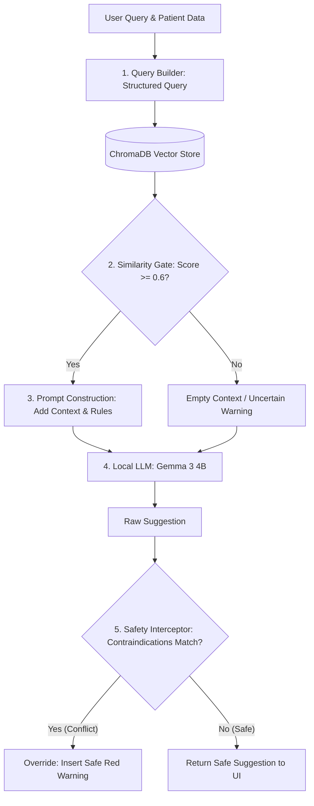

# PhysioWave — Technical Architecture & Development Spec

> **Note to Future AI Assistants / Pair Programmers:** 
> This document serves as the ground-truth technical specification, database schema diagram, and development roadmap for the **PhysioWave** codebase. Read this document before proposing any structural changes, editing RAG pipelines, or modifying safety gates.

---

## 1. Project Context & Philosophy
PhysioWave is an offline-first, HIPAA-compliant clinical assistant designed for physiotherapists. It helps professionals correctly operate a Physiotherapy Combi 5-in-1 machine (TENS, IFT, MS, Ultrasound, Deep Heat) and suggests evidence-based therapy protocols.

### Core Architectural Constraints
* **100% Local Execution:** For HIPAA compliance, no clinical documents, patient records, or search queries may leave the physical machine. All LLM inference, embedding generation, and vector indexing happen locally.
* **Deterministic Safety Overrides:** AI suggestions are probabilistic and prone to hallucinations. A deterministic safety registry overrides any contraindicated therapies (e.g., preventing ultrasound recommendations for patients with metal implants).

---

## 2. Technology Stack & Directory Structure
* **Frontend:** Next.js 15 (App Router), Tailwind CSS.
* **Backend:** FastAPI, `aiosqlite` (async SQL database), `loguru` (console & rotating file logging).
* **AI local Engine:** Ollama running `gemma3:4b` (LLM inference), `moondream`/`llava` (multimodal vision), and `nomic-embed-text` (embeddings).
* **Vector Store:** ChromaDB (persistent local SQLite backend).
* **PDF Processing:** PyMuPDF (image and text extraction).

---

## 3. RAG Ingestion & Search Strategy

### Ingestion Pipeline
1. **Extraction (PyMuPDF):** Documents are chunked into size `1500` characters with `200` characters overlap.
2. **Vision Captioning (Multimodal):** Embedded diagrams (dials, placement maps) are extracted. A local vision model generates text descriptions (e.g., *"Diagram showing knee electrode placement for IFT"*). Captures are appended as text chunks.
3. **Embedding:** Text chunks are embedded using **`nomic-embed-text`** (768-dimensional dense vectors, 8192-token context window).
4. **Storage:** Chunks are indexed in ChromaDB using a Hierarchical Navigable Small World (**HNSW**) graph configured with **Cosine Similarity** (`{"hnsw:space": "cosine"}`).

### Retrieval & Search Pipeline
* **Search Type:** Dense Semantic Search.
* **Query Builder:** Programmatically converts raw inputs into a structured search query string using demographic and clinical tags.
* **Similarity Thresholding:** ChromaDB returns Cosine Distance. We convert this to similarity: `score = 1.0 - distance`. Any chunk with a similarity score $< 0.6$ is discarded to eliminate noisy context.
* **Fallback Logic:** If no chunks meet the threshold, a fallback message (`"No specific clinical context found..."`) is passed, causing the LLM to output its uncertainty safety warning rather than guessing.

---

## 4. Relational Database & PII Security (HIPAA)
Patient data is segregated into plaintext clinical tables and an encrypted PII table. Encryption is handled via AES-256 (Fernet symmetric encryption) using a key stored in the environment.

### Database Schema Entity-Relationship (ER) Model

```
 ┌────────────────────────┐
 │        patients        │ ◄──────────────────────────────┐
 ├────────────────────────┤                                │
 │ id (PK)                │                                │
 │ age (INT)              │                                │
 │ gender (TEXT)          │                                │
 │ risk_factors (TEXT)    │ ── JSON Array (Plaintext)      │
 │ notes (TEXT)           │                                │
 └───────────┬────────────┘                                │
             │                                             │
             ├────────────────────────────────┐            │
             ▼ (1-to-1 Relationship)          ▼ (1-to-Many)│ (1-to-Many)
 ┌────────────────────────┐       ┌────────────────────────┐
 │      patient_pii       │       │        sessions        │
 ├────────────────────────┤       ├────────────────────────┤
 │ patient_id (FK-PK)     │       │ id (PK)                │
 │ encrypted_name (TEXT)  │       │ patient_id (FK) ───────┘
 │ encrypted_dob (TEXT)   │       │ symptoms (TEXT)        │
 │ encrypted_phone (TEXT) │       │ vitals (TEXT) ─────────── JSON Object
 │ encrypted_email (TEXT) │       │ diagnosis (TEXT)       │
 │ encrypted_address (TEXT)       │ therapy_used (TEXT)    │
 └────────────────────────┘       │ machine_settings (TEXT)── JSON Object
                                  │ pain_score_before (INT)│
                                  │ pain_score_after (INT) │
                                  │ status (TEXT)          │
                                  └───────────┬────────────┘
                                              ▼ (1-to-Many)
                                  ┌────────────────────────┐
                                  │     ai_suggestions     │
                                  ├────────────────────────┤
                                  │ id (PK)                │
                                  │ session_id (FK) ───────┘
                                  │ query (TEXT)           │
                                  │ suggestion (TEXT)      │
                                  │ source_chunks (TEXT) ─── JSON Array
                                  │ is_safe (INT)          │
                                  └────────────────────────┘
```

---

## 5. Hallucination Controls & Safety Interception
To ensure patient safety in clinical recommendations, the system uses a **multi-layered defense-in-depth model**:



### Safety Interceptor ("Redline" Gate)
The `SafetyInterceptor` intercepts the raw output of the LLM. It extracts therapy keywords (TENS, ultrasound, etc.) and evaluates them against the patient's database-loaded `risk_factors` (contraindications). 
* **If safe:** Suggestion is returned normally.
* **If contraindicated:** The advice is blocked, and replaced with a structured redline warning page preventing protocol activation.

---

## 6. Testing & Quality Verification
* **Automated Unit Tests:** Pytest suites verify the contraindications logic and interceptor behaviors.
  * [`backend/tests/test_contraindications.py`](file:///c:/Users/geral/Documents/GitHub/physiowave/backend/tests/test_contraindications.py) — Assures correct safety rules.
  * [`backend/tests/test_interceptor.py`](file:///c:/Users/geral/Documents/GitHub/physiowave/backend/tests/test_interceptor.py) — Validates that unsafe generated texts are blocked.
* **Traceability Verification:** The backend attaches raw `source_chunks` (containing filenames and page numbers) to every API response. The frontend displays these in an accordion, enabling manual **human-in-the-loop** verification.

---

## 7. Future Development Roadmap

### A. Local RAG Evaluation Framework
To measure search precision and answer faithfulness offline without cloud APIs:
* **LLM-as-a-Judge:** Run a local model (e.g. `gemma3:12b` or `prometheus-eval`) to rate:
  1. *Faithfulness:* Does the response contain claims not present in the reference context?
  2. *Answer Relevance:* Does the generated therapy guide resolve the question?
  3. *Context Relevance:* Were retrieved chunks necessary or just noise?
* **Golden Dataset Benchmarking:** Compile a version-controlled JSON set of common clinical queries with ground-truth source documents. Measure **Hit Rate @ K** and **Mean Reciprocal Rank (MRR)** during updates.
* **Synthetic Test Generator:** Build a local script that generates questions from manual chunks to automate benchmark building.

### B. Advanced Retrieval & Prompt Engineering
* **Parent-Child Chunking:** Index short vector chunks (200 chars) for search accuracy, but retrieve and feed the larger parent section (2000 chars) to the LLM to retain document headers.
* **JSON Schema Generation (JSON Mode):** Enforce strict JSON output schemas (using libraries like `Instructor` locally) to eliminate free-text conversational hallucinations and lock down dosage numbers.
* **Graph-RAG Integration:** Query the entity graph parsed from the codebase to retrieve relational rules (Symptom $\rightarrow$ Modality $\rightarrow$ Contraindication) in addition to text.

### C. Self-Improving Feedback Loop & PEFT
* **RLCF outcomes indexing:** Capture pre- and post-session pain scores (VAS delta). Flag sessions with a delta drop $\ge 3$ as "Gold-Standard Outcomes", vectorize them, and load them into a separate outcomes vector database as dynamic few-shot exemplars.
* **Parallel QLoRA Adapter Fine-Tuning:** Run an offline, low-priority cron job on local workstation GPUs to fine-tune a LoRA adapter using these PII-free gold-standard cases. Hot-swap the resulting adapter onto Ollama (`ADAPTER /path/to/lora`) to specialize Gemma 3 for the clinic's local needs.

---
